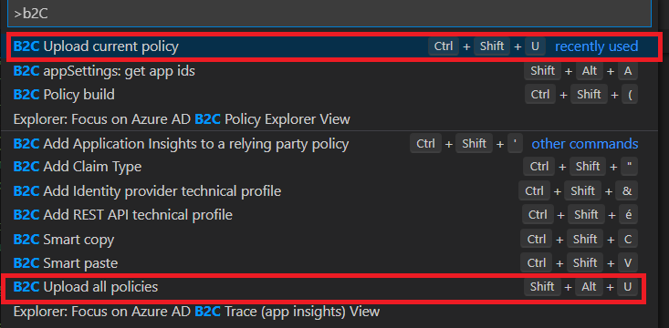
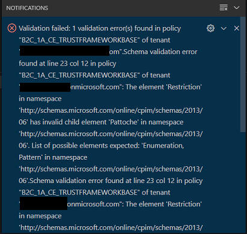
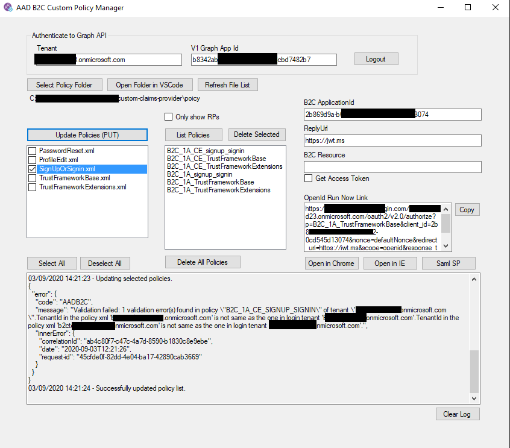

# Azure B2C - Samples & Tools for custom policies 

## Context

For someone who wants to learn about custom policies in B2C, first step should definitely be to read Microsoft documentation and tutorials.

Microsoft tutorial getting started : 
https://docs.microsoft.com/en-us/azure/active-directory-b2c/custom-policy-get-started 

Starter pack direct link :  
https://github.com/Azure-Samples/active-directory-b2c-custom-policy-starterpack 

That said, even after that, there is still a bit of a challenge to master B2C. 

This article intends to help you as best as possible by providing usefull samples and tools.

## Samples

Microsoft Samples : 
https://github.com/azure-ad-b2c/samples

## Tools

### Author

Unless XML is your second language, you have to use Visual Studio Code and add the Azure AD B2C extension, it will change your life.

Visual Studio Code is free and cross-platform, and so is the extension, so you have no excuses.

Visual Studio Code link : https://code.visualstudio.com/

B2C extension : https://github.com/azure-ad-b2c/vscode-extension 

What you can do with it : 

Features | Screenshots
------------ | -------------
First it is really convenient to review an existing policy by using the Azure AD B2C Policy Explorer on the left bar, it allow us to navigate easily within it and to have an overview of the policy  | 
Then to add your own piece of code you can leverage the Ctrl+Shift+P shortcut of Visual Studio Code to access the command pane and then write "b2c" to get all the useful shortcuts for b2c | 
You obviously will have autocomplete when writing new stuff | 
You can drag your mouse over the main Xml node to access to help easily | 
If you are still not convince, let me introduce you to the best feature possible which is the ability to manage multiple environments.   What you need to do is the following :   1. Execute B2C policy build a first time, it will ask you to create an appsettings.json, say yes.   2. Edit this appsettings to make it match your environments. You may remove some if you want to.   3. In your policy files, replace your name and tenant by {settings:Tenant} or similar.   4. Execute B2C policy build again to generate policy files for all your environments in one go  How cool is that ! |   

There are even more features such as smart copy paste and get B2C application IDs that I did not speak about. 

You can find additionnal information in the main documentation : https://github.com/azure-ad-b2c/vscode-extension
 
### Upload

Once you have authored your policy, I'm guessing you will upload in Azure, and unless you like to struggle with uploading within the Azure Portal, here are better alternatives for you : 
  - the Custom policy manager tool :  https://github.com/azure-ad-b2c/custom-policy-manager 
  - or Visual Studio Code extension again
  
 For both of them you will need to register an application with delegated permissions and to have a global admin account within the B2C directory.
 
 The custom policy manager tool is a bit more complex to install as you also need Visual Studio as a prerequisite to compile the project and one more application registration to do. That said I have a preference for this tool so let me first by showing you how Visual Code works :
 
 Once you've done the installation describe here you will have 2 possible actions to upload your policies :
 
 

Then you can see the result in a Visual Code Notification :

 

Now I've made an issue in my file on purpose and you see the actual error message is truncated because it's too long.

Also, I can upload but I have no overview of what is already on Azure.

Because of these two issues, I tend to prefer the custom policy manager tool :
 

### Troubleshoot 

Collecting Log with Application Insights : https://docs.microsoft.com/en-gb/azure/active-directory-b2c/troubleshoot-with-application-insights 
- To read logs, you may use : 
  - Applications insights log panel : https://docs.microsoft.com/en-us/azure/azure-monitor/platform/data-platform-logs 
  - User Journey Recorder : https://github.com/Azure-Samples/active-directory-b2c-advanced-policies/tree/master/UserJourneyRecorder
  - VS Code extension can be used as well for that
- To decode token : 
  - https://jwt.io/ 
  - https://jwt.ms/

